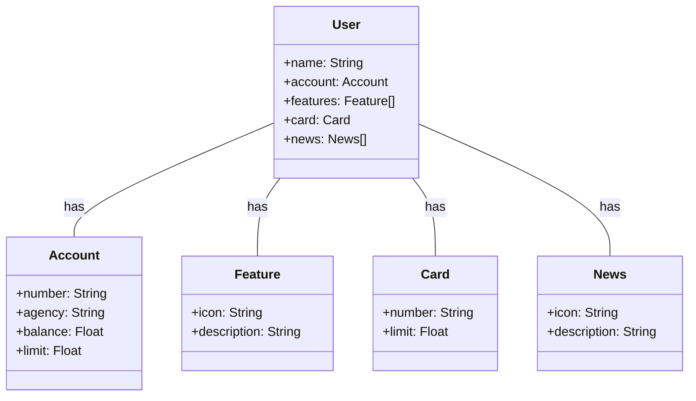

# santander-bootcamp-2023
java restful api

## Diagrama de classes

```mermaid
classDiagram
  class User {
    +name: String
    +account: Account
    +features: Feature[]
    +card: Card
    +news: News[]
  }

  class Account {
    +number: String
    +agency: String
    +balance: Float
    +limit: Float
  }

  class Feature {
    +icon: String
    +description: String
  }

  class Card {
    +number: String
    +limit: Float
  }

  class News {
    +icon: String
    +description: String
  }

  User -- Account : has
  User -- Feature : has
  User -- Card : has
  User -- News : has
```
